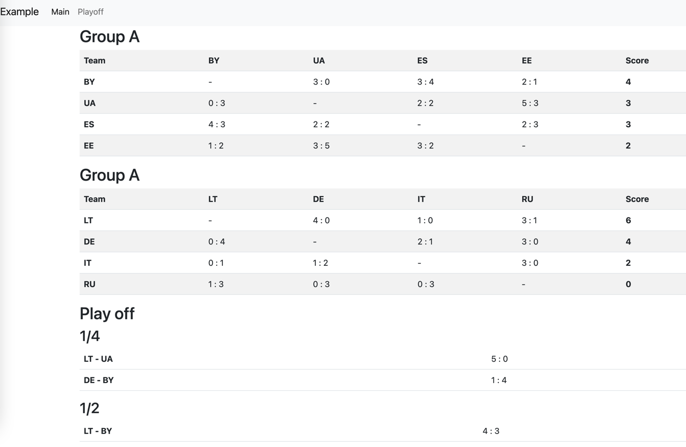

Турнирная таблица (Тестовое задание)
====================================

- Данные будут сгенерированны автоматически
- Персистентный слой не реализован (суть показать ООП)
- UI на базе bootstrap 

TODO
- нейминг
- дописать тесты
- добавить скрины
- сделать 4 дивизиона на 8 команд


Install
-------

Preconditions:
- install locally php8
- install composer

```
git clone ....
composer install
symfony server:start
// open url (see in console output)
```


Example output
---------------



