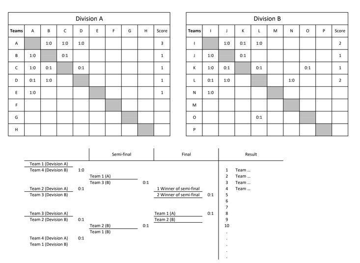
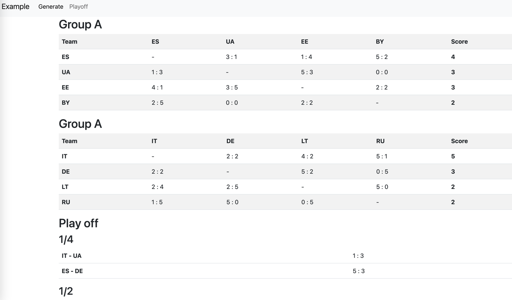

Турнирная таблица (пример тестового задания)
====================================
Условие задачи:
Сгенерировать турнирную таблицу, где команды разделены на 2 дивизиона A и B.
В каждом дивизионе команды играют каждая с каждой и, в конечном результате, 4
лучшие команды из каждого дивизиона выходят в плей-офф.
График игр плей-оффа проходят по принципу &quot;ёлочки&quot;: лучшая команда играет против
слабейшей, где победитель проходит дальше, а проигравший выпадает из
дальнейшего участия.
В результате победит та команда, которая выиграет во всех играх плей-оффа.




- Данные будут сгенерированны автоматически
- Персистентный слой не реализован (суть показать ООП)
- UI на базе bootstrap 


Install
-------

Preconditions:
- install locally php8
- install composer

```
git clone ....
composer install
symfony server:start
// open url (see in console output)
```


Example output
---------------



